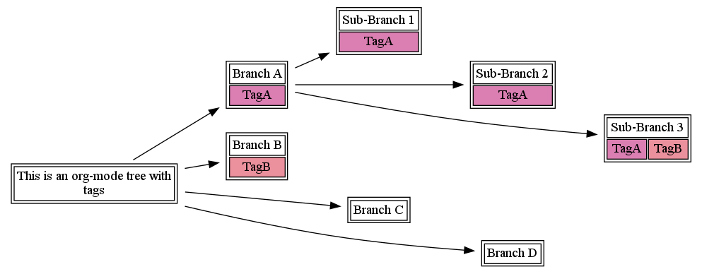
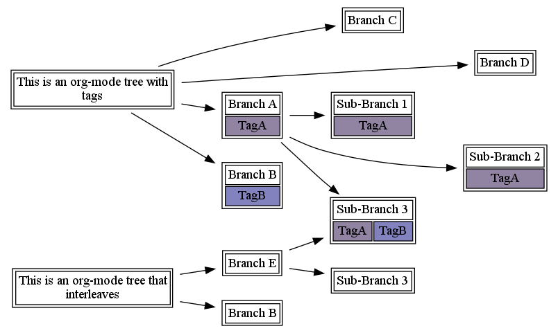

# org-mind-map
This is an emacs package that creates graphviz directed graphs.

# Requirements

This package relies on the [Graphviz](http://graphviz.org/) suite of graphical diagramming tools. For windows (the default option), these tools are available via [cygwin](http://cygwin.com/). For linux, these tools are available through any of the popular package managers.

This package also relies on the org-mode and dash libraries, available from melpa (M-x list-packages).

# Installation and usage

To install, add this code to your .emacs:

```elisp
(load "INSTALLPATH/org-mind-map.el")
```

Then, run M-x org-mind-map/write within the org-mode file you would like to make a mind-map for. If all works as expected, a PDF file will be generated in the same directory as the org file.

# Examples

## Basic concept

Here is an example org-mode tree that demonstrates the basic concept:

```Org
* This is an example org-mode tree
The content of the node doesn't matter.
** Branch A
*** Sub-Branch 1
*** Sub-Branch 2
*** Sub-Branch 3
** Branch B
** Branch C
** Branch D
```

and the result is shown below:


## Tags

You can also add tags, as in this org-mode file:

```Org
* This is an org-mode tree with tags
** Branch A :TagA:
*** Sub-Branch 1 :TagA:
*** Sub-Branch 2 :TagA:
*** Sub-Branch 3 :TagA:TagB:
** Branch B :TagB:
** Branch C
** Branch D
```

These are randomly color-coded into pastel tags:



## Interleaving Graphs

Finally, by naming headlines across your org-mode file, as shown below, you can interleave trees.

```Org
* This is an org-mode tree with tags
** Branch A :TagA:
*** Sub-Branch 1 :TagA:
*** Sub-Branch 2 :TagA:
*** Sub-Branch 3 :TagA:TagB:
** Branch B :TagB:
** Branch C
** Branch D
* This is an org-mode tree that interleaves
** Branch E
*** Sub-Branch 3
*** Sub-Branch 3 :TagA:TagB:
** Branch B
```


 this results in this file:



Note that the interleaving is done 
